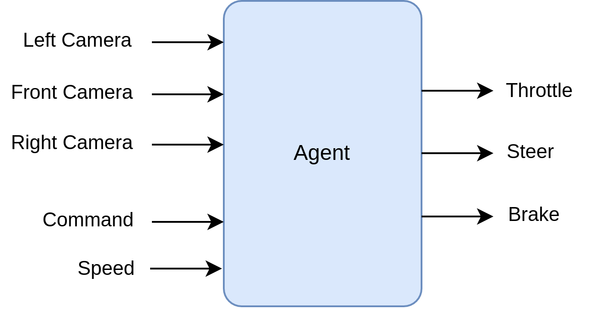
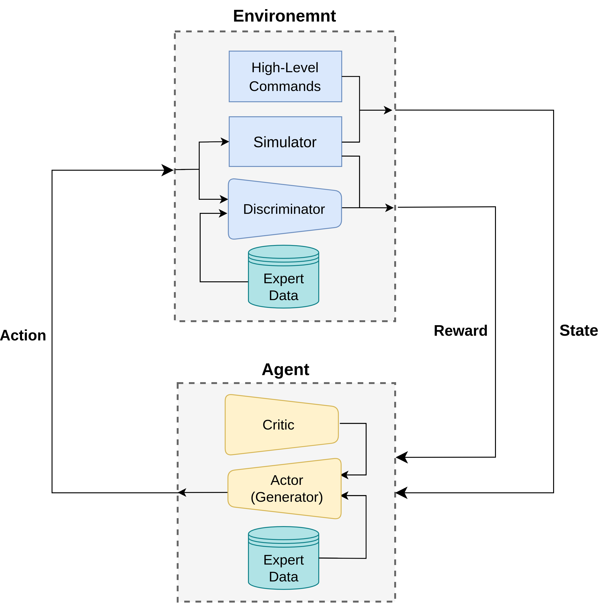
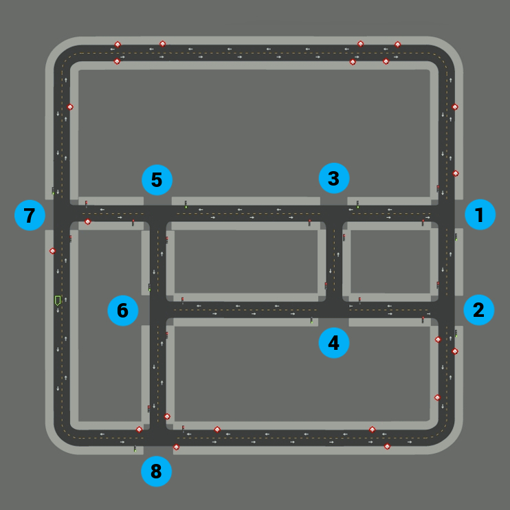

# Self-Driving-GAIL

This is the final project for my BSc in Computer Engineering at Amirkabir University of Technology (AUT), September 2022.

# Design

# Dataset

# Results

# How to Run
Will be added soon...

# References
- [End-to-end Driving via Conditional Imitation Learning](https://arxiv.org/abs/1710.02410)
- [Generative Adversarial Imitation Learning](https://arxiv.org/abs/1606.03476)
- [Generative Adversarial Imitation Learning for End-to-End Autonomous Driving on Urban Environments](https://arxiv.org/abs/2110.08586)
- [Proximal Policy Optimization Algorithms](https://arxiv.org/abs/1707.06347)
