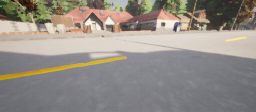
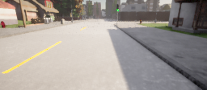
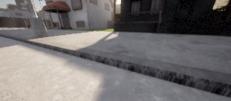
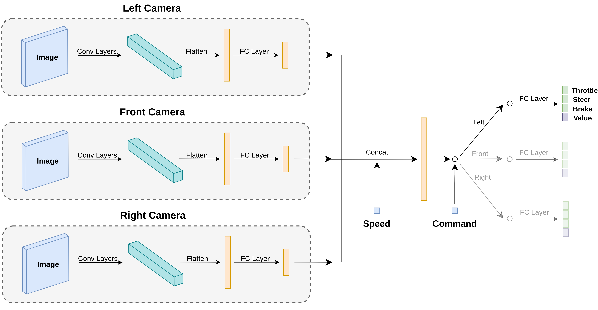
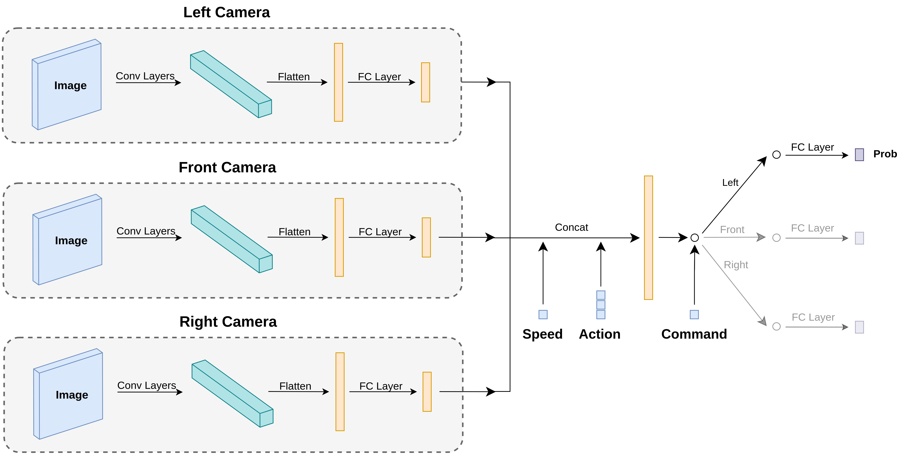

# Self-Driving-GAIL

This is the final project for my BSc in Computer Engineering at Amirkabir University of Technology (AUT), September 2022.

# Design

## Black Box

    

## System Architecture

    

## Camera Setup

Left Camera             |  Front Camera        |  Right Camera
:-------------------------:|:-------------------------:|:-------------------------:
  |   | 

## Network Architecure

Agent Network:
 

    

 
Discriminator Network:
 

    

## Dataset

    

## Sample Results

Long Route:
 

https://user-images.githubusercontent.com/36497794/229384560-59c0bf97-97eb-4109-93a2-4fef26303c4e.mp4

 
Noisy Wheel:
 

https://user-images.githubusercontent.com/36497794/229385027-5c74754b-a69c-4f39-a32e-6077b3b5d2bd.mp4

# How to Run
A guide to setup the training environment and run the codes along with the trained models will be added soon...

# References

## Papers
- [End-to-end Driving via Conditional Imitation Learning](https://arxiv.org/abs/1710.02410)
- [Generative Adversarial Imitation Learning](https://arxiv.org/abs/1606.03476)
- [Generative Adversarial Imitation Learning for End-to-End Autonomous Driving on Urban Environments](https://arxiv.org/abs/2110.08586)
- [Proximal Policy Optimization Algorithms](https://arxiv.org/abs/1707.06347)
